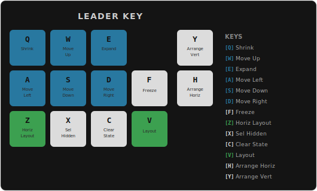

# Node Layout

A plugin for [The Foundry's Nuke](https://www.foundry.com/products/nuke-family/nuke) that automatically arranges node graphs into clean, readable hierarchies. Instead of manually dragging nodes around your DAG, you select a node and let the plugin lay out its entire upstream tree — with intelligent spacing, color-aware grouping, automatic Dot node insertion, and collision avoidance for surrounding nodes.

---

## Installation

1. Download the zip of the repo and unpack into your `.nuke` as `node_layout` or clone the repo in your `.nuke`.

2. Add that folder to your Nuke plugin path. The most common way is to add a line like this to your `~/.nuke/menu.py` (create it if it doesn't exist):

   ```python
   import nuke
   nuke.pluginAddPath('/path/to/your/folder')
   ```

   If you are at a studio, place the folder somewhere on your shared plugin path and add the `pluginAddPath` call to the appropriate `menu.py`.

As this is a UI-only module, it shouldn't be needed on the farm, and so `menu.py` makes more sense than init.py.

4. Restart Nuke. The commands will appear under **Edit → Node Layout**.

---

## Features

### Layout Upstream — `Shift+E`

Automatically lays out all visibly upstream nodes above a selected node. Nodes whose inputs are hidden (via the `hide_input` flag) act as leaves — the layout does not follow connections beyond them.

Select any node in your DAG and press `Shift+E`. Every node feeding into it — directly or through arbitrarily deep chains — is repositioned into an organized tree above it. The selected node stays exactly where it is; only its inputs move.

**How input nodes are arranged:**

- The primary input (input 0) is placed directly above the selected node in the same column.
- Additional inputs (input 1, 2, …) are stepped to the right of the node, each in its own column, with a Dot node inserted automatically on each side branch so the wire routing stays clean.
- Each input's entire upstream subtree gets its own exclusive vertical band, so no two subtrees ever overlap vertically.
- The bands stack so that the last input is closest to the root node and the first input is farthest up.

**Color-aware spacing:**

When two adjacent nodes share the same tile color *and* belong to the same toolbar category (e.g., both are Color nodes with a matching color), they are snapped together with a minimal gap. Nodes that differ in color or category get a larger gap, making visual groupings immediately readable.

**Mask input handling:**

Mask and matte inputs are detected automatically — by input label, by the presence of a `maskChannel` knob, or by node type (Merge/Dissolve input 2 is always treated as a mask). Mask inputs receive a narrower gap (roughly one-third of the normal gap) so the mask branch sits close to the node it feeds, and mask columns are always placed rightmost when there are multiple side inputs.

**Surrounding node displacement:**

After layout, the plugin compares the subtree's bounding box before and after. If the tree grew upward or rightward, any nodes that were sitting in that newly occupied space are automatically pushed out of the way. Nodes that were already overlapping the original footprint are left untouched.

---

### Layout Selected

Lays out multiple selected nodes relative to each other.

Select two or more nodes and run **Edit → Node Layout → Layout Selected**. The plugin finds the most-downstream nodes among your selection (the "roots") and lays each one's upstream selected subgraph above it. When two roots' subtrees would overlap horizontally, the second root is shifted rightward by a full subtree margin to keep everything separated.

This is useful when you have several independent trees you want to clean up at once, or when you want to organize a subset of a larger graph without disturbing the rest.

---

### Layout Selected Horizontal

Lays out a sequence of nodes along a horizontal spine — primary inputs run leftward instead of upward.

Select a chain of nodes connected via input 0 and run **Edit → Node Layout → Layout Selected Horizontal**. The plugin identifies the most-downstream node as the chain root and follows `input(0)` leftward to define the spine. Secondary inputs (input 1, 2, …) are laid out vertically above their spine attachment point.

**Layout Selected Horizontal (Place Only)** places the spine without re-laying out the upstream side trees. Use this when a side subtree was already manually arranged and only the spine needs repositioning.

---

### Layout Variants: Compact and Loose

Each primary layout command has a **Compact** and **Loose** variant under **Edit → Node Layout**:

| Command | Effect |
|---|---|
| Layout Upstream / Selected Compact | Tighter inter-subtree spacing |
| Layout Upstream / Selected Loose | More generous inter-subtree spacing |

Spacing multipliers are configurable via **Edit → Node Layout → Node Layout Preferences…**

---

### Freeze / Unfreeze — `Ctrl+Shift+F` / `Ctrl+Shift+U`

Frozen nodes are treated as immovable leaves by the layout engine — their positions are never changed, and dependent nodes are arranged around them. When a freeze block contains multiple nodes, the block moves as a rigid unit (internal offsets preserved).

Select nodes and press `Ctrl+Shift+F` to freeze or `Ctrl+Shift+U` to unfreeze. Useful for anchoring Viewers, final grade outputs, or any manually-placed reference point while still re-laying out the rest of the tree.

Leader mode key: `F`.

---

### Shrink / Expand

Scale an entire layout in or out, centred on the root node:

| Command | Shortcut | Effect |
|---|---|---|
| Shrink Selected | `Ctrl+,` | Scale selected tree inward |
| Expand Selected | `Ctrl+.` | Scale selected tree outward |
| Shrink Upstream | `Ctrl+Shift+,` | Scale upstream tree inward |
| Expand Upstream | `Ctrl+Shift+.` | Scale upstream tree outward |

Axis-specific variants (horizontal-only, vertical-only) are available in the **Edit → Node Layout** menu. **Repeat Last Scale** (`Ctrl+/`) re-applies the most recent scale operation.

Leader mode keys: `Q` (shrink) and `E` (expand).

---

### Clear Layout State

Layout state (scheme, mode, freeze flag) is stored as a hidden knob on each node. To reset stale or incorrect state:

- **Clear Layout State Selected** — clears state on selected nodes.
- **Clear Layout State Upstream** — clears state on all visibly upstream nodes.

Both are under **Edit → Node Layout**. Leader mode key: `C`.

---

### Diamond Resolution (Automatic Dot Insertion)

When the same node is used as input in more than one place in a tree — a "diamond" pattern — the plugin automatically resolves it by inserting a hidden Dot node on the secondary path. This lets the layout algorithm treat the graph as a tree while keeping the actual node connections intact.

Non-mask paths are resolved first; mask paths are deferred and only get a Dot if the node they point to has already been claimed. This ensures the primary data flow takes the direct route.

---

### Leader Window — `Shift+D`

Press `Shift+D` to enter leader mode. After a brief delay a floating HUD appears over the DAG showing every available command mapped to a single key.



Press any key shown in the overlay to dispatch that command. There is no second modifier needed — just the bare key. You can also click any badge directly with the mouse.

**Key colour coding:**

- **Green** — primary layout actions (V, Z). Exits leader mode after dispatch.
- **Teal/blue** — chaining keys (W, A, S, D, Q, E). Stay in leader mode so you can nudge or scale repeatedly without re-pressing `Shift+D`.
- **White/gray** — single-shot utility keys (F, C, X, H, Y). Exit leader mode after dispatch.

Any unrecognised key or mouse click outside the overlay dismisses it without doing anything.

**Commands:**

| Key | Action | Behaviour |
|-----|--------|-----------|
| `V` | Layout | 1 node selected → layout upstream; 2+ nodes → layout selected |
| `Z` | Horiz Layout | Lay out the selection along a horizontal spine |
| `F` | Freeze | Freeze selected nodes (pin them so layout skips them) |
| `C` | Clear State | Clear layout state; context-aware (upstream or selected) |
| `X` | Sel Hidden | Select downstream nodes whose inputs are hidden |
| `H` | Arrange Horiz | Arrange selected nodes in a horizontal row |
| `Y` | Arrange Vert | Arrange selected nodes in a vertical column |
| `W` | Move Up | Shift selected nodes up (chaining) |
| `A` | Move Left | Shift selected nodes left (chaining) |
| `S` | Move Down | Shift selected nodes down (chaining) |
| `D` | Move Right | Shift selected nodes right (chaining) |
| `Q` | Shrink | Scale down selected or upstream tree (chaining) |
| `E` | Expand | Scale up selected or upstream tree (chaining) |

---

### Select Upstream Ignoring Hidden — `E`

Select a node and press `E`. All visibly upstream nodes are selected. This is handy for grabbing an entire dependency chain before running Layout Selected, or before moving a subgraph.

---

### Sort By Filename

Select multiple Read nodes (or any nodes with a `file` knob) and run **Edit → Node Layout → Sort By Filename**. The nodes are sorted alphabetically by their file path and laid out in a horizontal row starting from the leftmost position of the selection.

---

### Make Room

A set of commands for quickly shifting nodes to create space in your DAG.

| Command | Shortcut | Effect |
|---|---|---|
| Make Room Above | `[` | Move nodes up 1600 px |
| Make Room Below | `]` | Move nodes down 1600 px |
| Make Room Above (smaller) | `Ctrl+[` | Move nodes up 800 px |
| Make Room Below (smaller) | `Ctrl+]` | Move nodes down 800 px |
| Make Room Left | `{` | Move nodes left 800 px |
| Make Room Right | `}` | Move nodes right 800 px |

**With a selection:** The selected nodes are moved by the specified amount in the specified direction.

**Without a selection (up/down only):** All nodes above or below the current cursor position are shifted. This lets you insert breathing room between two sections of a graph without selecting anything first.

---

### Safe Delete — `Backspace` / `Delete`

Node Layout replaces Nuke's stock delete behaviour. Nuke's built-in delete warns about broken hidden-input and expression links even when every dependent of the deleted node is also being deleted in the same operation — which trains users to dismiss the dialog without reading it.

Safe Delete only shows the warning dialog when a deleted node has dependents that are **not** also being deleted, i.e. when the operation would actually leave a dangling link. Viewer nodes are always treated as benign.

Safe Delete is enabled by default and can be toggled in **Edit → Node Layout → Node Layout Preferences…**

---

### Preferences

**Edit → Node Layout → Node Layout Preferences…** opens a dialog for configuring:

- **Spacing multipliers** for compact, normal, and loose layout schemes
- **Horizontal layout gaps** — spine-to-spine and side-subtree margins
- **Mask input ratio** — how much narrower mask branches appear
- **Leader popup delay** — delay before the overlay appears after `Shift+D`
- **Keyboard layout** — QWERTY, AZERTY, or QWERTZ (remaps chaining keys to correct physical positions)
- **Safe Delete** — toggle the smarter delete behaviour on or off

Preferences are saved to `~/.nuke/node_layout_prefs.json`.

---

## How Spacing Is Calculated

Spacing adapts to the snap threshold you have configured in Nuke's preferences (`dag_snap_threshold`). The base margins are:

- **Normal subtree margin:** 300 px — vertical clearance between adjacent input subtrees
- **Mask input margin:** 100 px — narrower clearance for mask/matte branches

The gap between an input node and the node it feeds into is:

- **Tight (snap\_threshold − 1 px):** when the two nodes share the same tile color and the same toolbar category
- **Loose (12 × snap\_threshold):** otherwise

This means same-color nodes snap neatly together while nodes with different colors get a visible gap.

---

## Development

### Setting up pre-commit hooks

The repo ships a pre-commit hook in `.githooks/` that mirrors the CI checks (ruff lint + pytest). To activate it:

```bash
git config core.hooksPath .githooks
```

Run this once after cloning. Commits will be blocked if linting or tests fail.

### Running checks manually

```bash
ruff check .
pytest tests/ -v
```

---

## File Overview

| File | Purpose |
|---|---|
| `node_layout.py` | Public command API and shared utilities: layout entry points, scale commands, freeze/unfreeze, DAG helpers (subtree collection, bounding box, selection roots) |
| `node_layout_bbox.py` | Bbox layout engine: recursive geometry computation, packer dispatch, routing dot insertion, horizontal chain layout |
| `layout_contracts.py` | Pipeline value types: `LayoutRequest`, `LayoutScope`, `PreparedScope`, `LayoutResult`, `HorizontalParams` |
| `layout_orchestrator.py` | Shared pipeline runner — sequences scope → prepare → layout → apply → state-sync → push for every layout command |
| `layout_scope.py` | Scope construction: resolves participating nodes, freeze blocks, and pre-mutation bounding box |
| `layout_prepare.py` | Topology preparation: inserts routing dots and re-resolves post-mutation node and scale tables |
| `layout_apply.py` | Position mutation: writes computed xpos/ypos to live Nuke nodes |
| `layout_state_sync.py` | Hidden state write-back: persists per-node scheme and layout mode after each run |
| `layout_push.py` | Room-push stage: shifts surrounding nodes out of the way when the laid-out tree grows |
| `menu.py` | Registers all commands and keyboard shortcuts in Nuke's Edit → Node Layout menu |
| `make_room.py` | Bulk node displacement for creating space in the DAG |
| `safe_delete.py` | Replaces Nuke's default delete with a smarter version that only warns when a deletion actually breaks external dependencies |
| `node_layout_leader.py` | Leader key event filter and state machine (`Shift+D`) |
| `node_layout_overlay.py` | Floating HUD overlay widget displayed during leader mode |
| `node_layout_util.py` | Upstream selection, hidden-output selection, and file-based sorting utilities |
| `node_layout_prefs.py` | Preferences loading, defaults, and in-memory singleton |
| `node_layout_prefs_dialog.py` | Preferences UI dialog |
| `node_layout_state.py` | Per-node layout state persistence (freeze flag, scheme multiplier, layout mode) |
